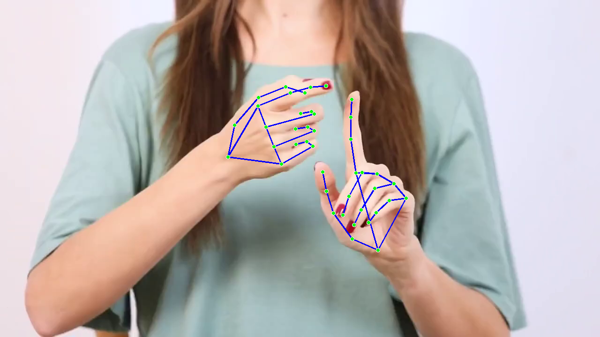

# Automatic Hand Tracking

This project utilizes SAM2 and mediapipe, in order to build an automatic pipeline that tracks hand movements in a video.

## Table of Contents

- [Installation](#installation)
- [Execution](#execution)
- [Part 1 (Find hand locations)](#part-1-find-hand-locations)
- [Part 2 (Create video with hand masks)](#part-2-create-video-with-hand-masks)

## Installation
SAM 2 needs to be installed first before use. We need `torch>=2.5.1`, as well as `python>=3.10`. Create a conda environment with python `python>=3.10`. Here we create a `conda` environment with `python=3.10` and activate it.

```shell
conda create -n sam2_test python=3.10 -y
conda activate sam2_test
```

Make sure you have `pip` installed to install the requirements.

```shell
git clone https://github.com/NickGreen99/Automatic-Hand-Tracking.git
cd Automatic-Hand-Tracking/
pip install -r requirements.txt --index-url https://download.pytorch.org/whl/cu118 --extra-index-url https://pypi.org/simple
```

If you are installing on Windows, it's strongly recommended to use Windows Subsystem for Linux (`WSL`) with Ubuntu to run the `.sh` file. Keep in mind for the `.sh` file to work, the line endings need to be `LF` not `CRLF` which is the default for Windows systems. Therefore you need a text editor to change it to `LF`, save and then run the following commands. Another thing you can do is run the shell script in WSL and drag the `.pt` files in the `checkpoints` folder.

```shell
cd checkpoints
bash download_ckpts.sh
cd ..
```
## Execution

Once all the necessary installations are complete, run the `main.py` file.

## Part 1 (Find hand locations)

The file `hand_locations.py` has the simple Python function `hand_locations()` that uses MediaPipe Hands to detect hand landmarks in the first frame of a given video. It takes as an input the path to a video file and it returns a 4 dimensional NumPy array containing the (x, y) coordinates for up to two hands, each with 21 landmarks.

This function processes the first frame of a video to detect hand landmarks using MediaPipe. These landmarks are converted to pixel coordinates (x, y).  These landmarks will then  be used as prompt points in Part 2.The output is a NumPy array with shape `(1, 2, 21, 2)` where the dimensions correspond to one frame, up to two hands, 21 landmarks per hand, and two coordinates (x, y). 

Below is a list of all hand landmarks (wrist, thumb, index finger, middle finger, ring finger, pinky) :

| Landmark Index | Name       | Typical Location                           |
|---------------:|:-----------|:-------------------------------------------|
| 0             | WRIST      | Base of the palm                           |
| 1             | THUMB_CMC  | Thumb carpometacarpal joint                |
| 2             | THUMB_MCP  | Thumb metacarpophalangeal joint            |
| 3             | THUMB_IP   | Thumb interphalangeal joint                |
| 4             | THUMB_TIP  | Tip of the thumb                           |
| 5             | INDEX_MCP  | Index finger metacarpophalangeal joint     |
| 6             | INDEX_PIP  | Index finger proximal interphalangeal joint|
| 7             | INDEX_DIP  | Index finger distal interphalangeal joint  |
| 8             | INDEX_TIP  | Tip of the index finger                    |
| 9             | MIDDLE_MCP | Middle finger MCP joint                    |
| 10            | MIDDLE_PIP | Middle finger PIP joint                    |
| 11            | MIDDLE_DIP | Middle finger DIP joint                    |
| 12            | MIDDLE_TIP | Tip of the middle finger                   |
| 13            | RING_MCP   | Ring finger MCP joint                      |
| 14            | RING_PIP   | Ring finger PIP joint                      |
| 15            | RING_DIP   | Ring finger DIP joint                      |
| 16            | RING_TIP   | Tip of the ring finger                     |
| 17            | PINKY_MCP  | Little finger MCP joint                    |
| 18            | PINKY_PIP  | Little finger PIP joint                    |
| 19            | PINKY_DIP  | Little finger DIP joint                    |
| 20            | PINKY_TIP  | Tip of the little finger                   |

As seen below Mediapipe is essential for helping as locate the position of the hands.



## Part 2 (Create video with hand masks)

This function generates segmentation masks for hand regions in a video using the output from `hand_locations()`. It initializes the SAM2 video predictor model and uses hand landmarks and bounding boxes as prompts to segment specific hand regions in each frame. Its input parameters are the NumPy array calculated in Part 1 and the output video path which defaults to `output_video.mp4`.

The function processes a video by identifying landmarks for each hand, defining bounding boxes around those landmarks, and using these as inputs to the SAM2 model. 

Right hand points, labels, box and the resulting SAM2 mask:


Left hand points, labels, box and the resulting SAM2 mask:


The model generates segmentation masks for the specified regions, which are then visualized on the frames. These masks are propagated across the video to track hand movements. The function also combines the masks with the original video to create a segmented output video, saved as `output_video.mp4`. Here is frame 120, which is around the middle of the video.


